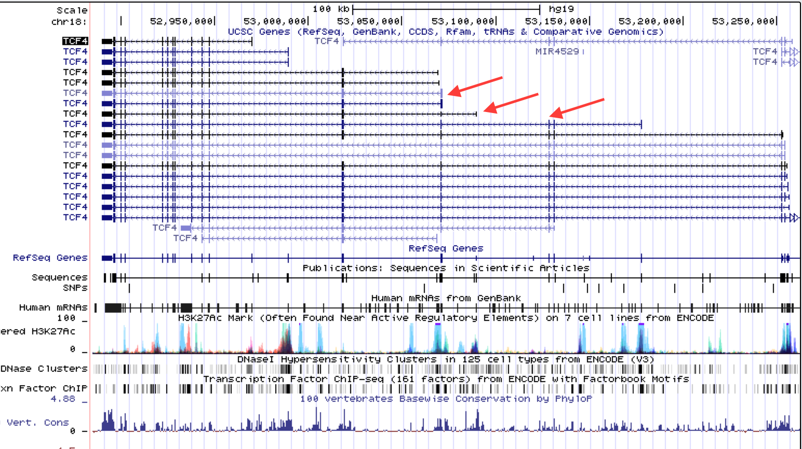

<!-- see http://rstudio.github.io/tufte/ for info about tufte -->
```{r setup, include=FALSE}
knitr::opts_chunk$set(echo = FALSE, message=FALSE, warnings=FALSE)
rm(list=ls())
library(dplyr)
library(data.table)
library(ggplot2)
library(tidyr)
library(tufte)
library(RColorBrewer)
library(scales)
source("~/BTSync/Code/R/FormatGGplot.R")
```

#DRD2 Splice Diversity
```{r dev.args = list(bg = 'transparent'), warning=FALSE}
DRD2 <- read.delim("~/BTSync/FetalRNAseq/GTEx/DRD2.txt", header=TRUE)
SampleAttributes <- read.delim("~/BTSync/FetalRNAseq/GTEx/GTEx_Data_V6_Annotations_SampleAttributesDS.txt")
SampleAttributes <- separate(SampleAttributes, SAMPID, c('GTEx', 'Individual', 'Tissue'), sep='-', extra="merge", remove=FALSE)


DRD2.1 <-gather(DRD2, SAMPID, Count, -1, -2, -3, -4)
DRD2.1$SAMPID=gsub(pattern="\\.", replacement='-', DRD2.1$SAMPID)
DRD2.1<- select(SampleAttributes, SAMPID, SMTS, SMTSD, Individual) %>%
  left_join(DRD2.1, .) 
```

`r margin_note("- A quick and dirty way to compare the counts over all junctions is to plot introns as line segments with their coordinates on the x axis and read counts on the y axis")`

`r margin_note("- The red line corresponds to the position of exon 6")`
`r margin_note("- The intron that spans this exon (short variant) has much lower counts than the two introns that abut it (long variant)")`
`r margin_note("- There is very little difference between large 5' UTR intron and the shorter shared intron, though the counts for both are WAY lower than the 3' introns")`

```{r dev.args = list(bg = 'transparent'), warning=FALSE}
filter(DRD2.1, SMTSD == 'Brain - Caudate (basal ganglia)') %>%
  group_by(TargetID) %>%
  summarise(Total = sum(Count)) %>%
  separate(TargetID, c('Chr', 'Start', 'End'), sep='_') %>%
  ggplot(aes(y=Total, yend=Total, x=as.numeric(Start), xend=as.numeric(End))) +
  geom_segment() + 
  geom_rect(xmin=113285100, xmax= 113285180, ymin = 0, ymax = 12000, colour='red') +
  tufte_theme() +
  theme(axis.text.x = element_text(angle=45)) +
  xlab('Chr 11') + ylab('Total Caudate count')
```

`r margin_note("- Of 193 individuals total the top 50% account for 93% of reads across all brain regions")`

```{r dev.args = list(bg = 'transparent'), warning=FALSE}
DRD2.Brain <-filter(DRD2.1, SMTS == 'Brain')

group_by(DRD2.Brain, Individual) %>% 
  summarise(Total = sum(Count)) %>% 
  ggplot(aes(x=Total)) + geom_histogram() + xlab('Total count across all brain regions') + ylab("Number of individuals") +tufte_theme()

TotalBrainCount <- sum(DRD2.Brain$Count)
group_by(DRD2.Brain, Individual) %>% 
  summarise(Total = sum(Count)) %>%
  arrange(desc(Total)) %>%
  mutate(cummulative_proportion=cumsum(Total)/TotalBrainCount) %>% .[floor(193/2),3] %>% as.character(.) %>% as.numeric(.)

```

`r margin_note("- For individuals expressing DRD2, it's expressed about equally between Caudate, Putamen and Nucleus accumbens")`

```{r dev.args = list(bg = 'transparent'), warning=FALSE}
filter(DRD2.Brain,grepl('113286143', TargetID)) %>%
  ggplot(aes(x=Individual, y=Count, fill=SMTSD)) + 
    geom_bar(stat='identity') +
    facet_grid(. ~ TargetID) +
    coord_flip() +
    tufte_theme() +
    theme(legend.position="right") +
    theme(legend.text = element_text(size=8))
```

`r margin_note("- Points are scaled by total counts because outliers are due to very low counts")`
`r margin_note("- In caudate, putamen and nucleus accumbens, long version is about 6x short")`
`r margin_note("- Substantia nigra and hypothalamus are closer to 3x")`

```{r dev.args = list(bg = 'transparent'), warning=FALSE}
filter(DRD2.Brain, grepl('113286143', TargetID)) %>%
  spread(TargetID, Count) %>%
  #filter(`11_113283605_113286143` + `11_113285183_113286143` > 4) %>%
  mutate(perc_short = `11_113283605_113286143`/(`11_113283605_113286143` + `11_113285183_113286143`)) %>%
  ggplot(aes(x=SMTSD, y=perc_short, size=`11_113283605_113286143` + `11_113285183_113286143`)) + 
  geom_boxplot(outlier.size=0, outlier.colour='white') +
  geom_jitter(alpha=.2, height=0, width=.5) + 
  coord_flip() +
  tufte_theme() 
```


# TCF4 splice diversity



`r margin_note("- TCF4 LoF transcript is rare, but expressed in brain, blood and ovary")`

```{r dev.args = list(bg = 'transparent'), warning=FALSE, fig.height=8}
TCF4 <- read.delim("~/BTSync/FetalRNAseq/GTEx/TCF4.txt", header=TRUE)
SampleAttributes <- read.delim("~/BTSync/FetalRNAseq/GTEx/GTEx_Data_V6_Annotations_SampleAttributesDS.txt")
SampleAttributes <- separate(SampleAttributes, SAMPID, c('GTEx', 'Individual', 'Tissue'), sep='-', extra="merge", remove=FALSE)


TCF4.1 <-gather(TCF4, SAMPID, Count, -1, -2, -3, -4)
TCF4.1$SAMPID=gsub(pattern="\\.", replacement='-', TCF4.1$SAMPID)
select(SampleAttributes, SAMPID, SMTS, SMTSD) %>%
  left_join(TCF4.1, .) %>%
  filter(grepl('18_53070749', TargetID)) %>%
  ggplot(aes(x=Count)) + 
    geom_histogram(binwidth=1) +
    facet_grid(SMTS ~ TargetID) +
    tufte_theme() +
    theme(strip.text.y = element_text(size = 8, angle = 0),
          axis.text.y = element_text(size = 6)) +
    scale_y_continuous(breaks=c(0, 600, 1200))
```

`r margin_note("- Within brain, it is expressed in all tissues")`

```{r dev.args = list(bg = 'transparent'), warning=FALSE, fig.height=6}
select(SampleAttributes, SAMPID, SMTS, SMTSD) %>%
  left_join(TCF4.1, .) %>%
  filter(grepl('18_53070749', TargetID)) %>%
  filter(SMTS == 'Brain') %>%
  ggplot(aes(x=Count)) + 
    geom_histogram(binwidth=1) +
    facet_grid(SMTSD ~ TargetID) +
    scale_y_continuous(breaks=c(60, 120)) +
    tufte_theme() +
    theme(strip.text.y = element_text(size = 8, angle = 0),
          axis.text.y = element_text(size = 6)) 
```

`r margin_note("- three cases where the TCF4 LoF transcript is expressed in two brain tissues in the same individual")`

```{r dev.args = list(bg = 'transparent'), warning=FALSE, fig.height=6}
select(SampleAttributes, SAMPID, SMTS, SMTSD, Individual) %>%
  left_join(TCF4.1, .) %>%
  filter(grepl('18_53070749', TargetID)) %>%
  filter(TargetID != '18_53070749_53128250') %>%
  filter(SMTS == 'Brain') %>%
  filter(Count > 0) %>%
  ggplot(aes(x=Individual, y=Count, fill=SMTSD)) + 
    geom_bar(stat='identity') +
    coord_flip() +
    facet_grid(. ~ TargetID) +
    scale_y_continuous(breaks=c(0, 1, 2)) +
    tufte_theme() +
    theme(legend.position="right") +
    theme(legend.text = element_text(size=8)) 

```